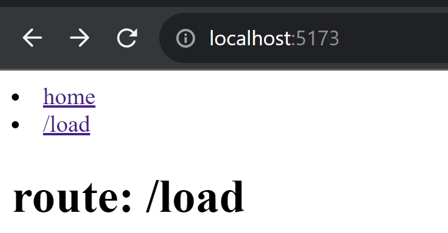
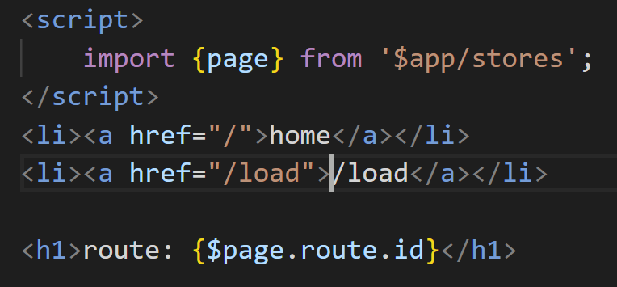

# Reproduction steps

1. `npm run dev`
2. Open in browser
3. Use navbar to open `/load`
4. Use navbar to open `home`
5. Click the browser `back` button twice within two seconds
    
The point is to navigate the second time before the promise from `/load/+page.server.js` resolves

## Result
`/load` gets rendered while address bar shows `/` 

## `+layout.svelte`:

# how this repo was created:

1. npm create svelte@latest my-app
   1. skeleton project
2. npm cd my-app
3. npm i
4. edit routes
5. run dev

# Routes

## `/`

Unmodified home page

## `/load`

New page with a barebones `+page.server.js` file, returning a promise resolving in 2 seconds with nothing

# Layout

Consists of: 
1. `<li>` nav
2. `{$page.route.id}`
3. `<slot />`

